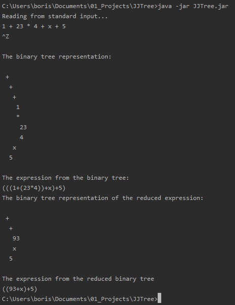
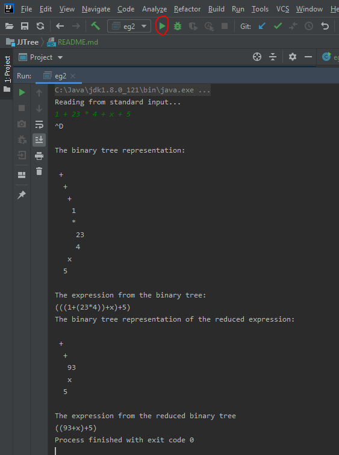

# JJTree - Borislav S. Sabotinov

Source code available on GitHub: https://github.com/bss8/cs5318-jjtree 

## To compile with JavaCC
1. Install JavaCC: https://javacc.github.io/javacc/
2. Navigate to where the eg2.jjt file is located. For me it is: `cd src`
3. `jjtree eg2.jjt`
4. `javacc eg2.jj`
5. Classes will be generated if needed. 

## Run the program via the IntelliJ IDE

1. Run the main class eg2.java (please refer to screenshot)
2. When prompted, enter a valid expression. Example `1 + 23 * 4 + x + 5`
3. Press Enter
4. Press Ctrl + D for end-of-stream character signal "\u0004"
5. Results will display and program will terminate

## Run the program via provided JAR

1. `java -jar JJTree.jar`
2. When prompted, enter a valid expression. Example `1 + 23 * 4 + x + 5`
3. Press Enter
4. Press Ctrl + Z for end of stream signal 

**NOTE:** Ctrl + D did not work for me when I executed the JAR, only when I executed via IntelliJ IDE terminal. 
To get the JAR working, I had to do Ctrl + Z. 

